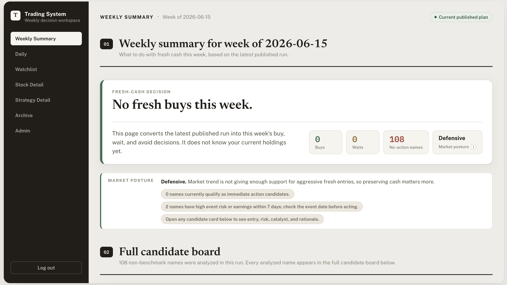
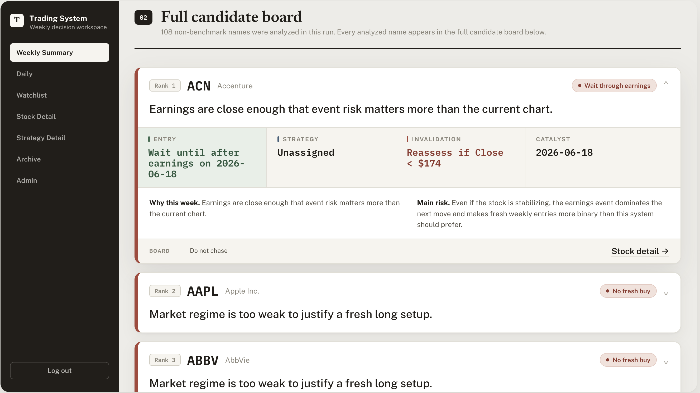
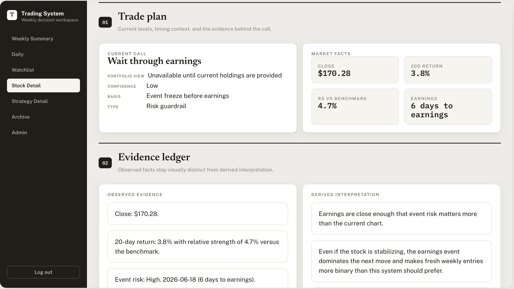
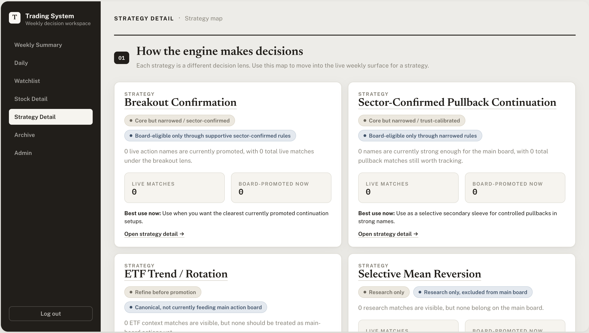

# 📈 Trading System

> A weekly equity-intelligence cockpit for a time-constrained investor. AI as evidence compressor; deterministic math as source of truth.

**Status:** A personal tool I built for my own weekly investing workflow. Single-user by design. Showcased here for the product structure, not as a distributable product.

> **Note:** Screenshots in this README use **redacted tickers and synthetic portfolio data**.

---

## The problem

Market context, stock research, tactical setups, longer-term conviction, event awareness, and options overlays all live in different places. For a time-constrained investor working a full-time job, that fragmentation means missed opportunities, inconsistent weekly decisions, and slow learning from prior calls.

## The wedge

Most retail and prosumer tools optimize for either *research abundance* (more screens, more news, more charts) or *execution speed* (faster fills, intraday alerts). Neither helps a weekend decision. The product compresses many inputs into a small, explainable, historically traceable weekly action list — and treats *weekly decision quality* as the only metric that matters.

## What it does

- Produces a **weekly action report**: market posture, buy-now ideas, pullback candidates, wait/avoid guidance, holder decisions, and options-overlay candidates.
- Separates **broad coverage**, **active watchlist**, **weekly focus board**, and a sparse **action board** of 3-5 names — so the engine can scan broadly without forcing the user to review hundreds of names.
- Publishes immutable **weekly run snapshots** with recommendation week, data-through date, run ID, strategy registry version, universe, and source lineage.
- Splits **observed facts** from **derived reasoning** on every stock detail surface, alongside entry logic, invalidation, targets, and current strategy trust.
- Maintains a **strategy registry** with promoted vs. research-only decision bases, so weak strategies don't quietly feed the main board.

> **Information design principle:** Every screen leads with the **call**, then exposes the **evidence**. The stock detail surface enforces an explicit visual split between *observed facts* and *derived interpretation* — so the user always knows what's a number vs. what's an opinion.

## Key product decisions

**Weekly cockpit, not a generic terminal or intraday trader.**
*Why:* The target user has limited weekday time. Intraday alerts and automated execution are explicit non-goals. The product wins or loses on the weekend workflow.

**Funnel architecture: coverage → watchlist → focus board → 3-5 name action board.**
*Why:* Broad scanning improves discovery. But the weekly experience must stay sparse and trusted — not turn into a flat 500-name feed.

**Weekly recommendations are explicit published runs — not "whichever CSV is newest."**
*Why:* A stale May report once looked like the current June plan. The system now preserves run metadata, current pointers, archive snapshots, and staleness warnings. Auditability matters more than convenience.

**AI as evidence compressor, not source of truth.**
*Why:* Summaries stay anchored to filings, transcripts, news, estimates, or price behavior. Deterministic calculations are kept out of the model layer. The model never makes the numbers.

**Strategy registry separates promoted from research-only.**
*Why:* "Good stock, wrong entry" is real. Mixing exploratory strategies into the main board destroys trust in everything else on it. Explicit promotion gates protect the signal.

## Stack

- **Frontend:** Server-rendered Jinja2 + hand-authored CSS
- **Backend:** Python 3.11, FastAPI, Typer jobs, Pydantic, SQLAlchemy, pandas/numpy
- **AI/LLM:** OpenAI API for summarization/classification (current core scoring is deterministic)
- **Data:** CSV snapshots + JSON manifests today; Supabase Postgres + Storage is the intended system of record. `yfinance` for bootstrap price data; FMP + SEC EDGAR planned for durable ingestion.
- **Hosting:** Railway (configured; some persistence still file-backed)
- **Notable:** Candidate-first strategy engine — feature preparation → strategy evaluation → risk suppression → board promotion. Pinned strategy registry versions. Immutable weekly run snapshots.

## Status

Personal tool. In single-user weekly use. Current published run: `weekly_2026-06-15` against an S&P 100 universe, data through 2026-06-12. Railway/Supabase configured; several persistence paths are still file-backed and being migrated.

**What this isn't:** This is human-in-the-loop decision support, not autonomous trading or investment advice. Not built for distribution.

---

### What I learned

A blended "strength score" feels precise but hides what actually matters. The product gets more trustworthy by separating *what's a good stock* from *what's a good entry* — and by making strategy provenance, regime gating, and sparse-board discipline visible on the surface. One number invites overconfidence; a structured surface invites judgment.

---

*Source code available on request. Reach out via LinkedIn.*
