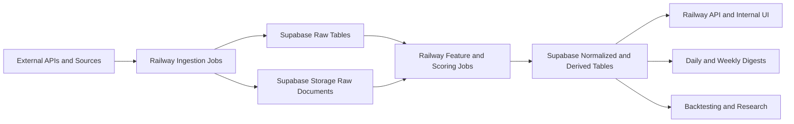

# Trading System High-Level Design

## Purpose

Translate the core thesis into a very high-level product design and an opinionated v1 technical design that fits a single-user system built primarily on Supabase and Railway.

## Assumptions

- One user only
- No brokerage integration in v1
- No real-time or intraday execution requirements in v1
- End-of-day and event-driven analysis is sufficient
- The first goal is decision support, not automation
- You already have Supabase and Railway accounts and want to bias toward using them

## Part 1: Product Strategist View

### Product promise

Build a personal trading intelligence system that helps answer two separate questions:

1. Which companies are becoming more attractive to own over time?
2. Which stocks have higher-quality tactical setups over the next days or weeks?

### Product principles

- Separate long-term investing logic from short-term trading logic
- Prefer structured evidence over free-form commentary
- Preserve history so every score can be compared over time
- Make outputs explainable enough that you can challenge them
- Design for weekly consistency, not perfect prediction

### Primary user

- A single technically strong investor managing a curated watchlist of roughly 50 to 70 stocks

### Non-goals for v1

- No automated order execution
- No multi-user accounts, permissions, or collaboration
- No HFT or low-latency streaming stack
- No options analytics platform
- No fully autonomous AI making unsupervised buy or sell decisions

### Core product jobs

The product should help you:

- Maintain a canonical watchlist
- Pull together fragmented information into one internal system
- Score each stock on long-term quality and short-term setup quality
- Flag important changes since the last review
- Surface the next best names to study or act on
- Build a record of what the system believed and what happened later

### V1 product modules

#### 1. Watchlist workspace

Maintain:

- Ticker
- Company name
- Sector and industry
- Strategy tags
- Position status
- User notes
- Active or inactive state

#### 2. Market and company data layer

Collect:

- Daily OHLCV price history
- Benchmark and sector context
- Earnings calendar
- Earnings transcripts
- Filings metadata and selected filing text
- Company and market news
- Analyst estimate and rating changes where available

#### 3. Signal engine

Compute:

- Technical trend and momentum signals
- Relative strength signals
- Volatility and participation signals
- Earnings and catalyst proximity
- Fundamental trend proxies
- Narrative-change and event-relevance classifications

#### 4. Intelligence layer

Produce separate outputs for:

- Long-term accumulation score
- Short-term setup score
- Risk warnings
- Upcoming event watch
- Evidence summary

#### 5. Delivery layer

Surface outputs through:

- Daily digest
- Weekly review
- Stock detail page
- Ranked watchlists
- Event-driven alerts for unusual changes

#### 6. Evaluation layer

Track:

- Historical scores
- Historical recommendations
- Post-event outcomes
- Which signals appear useful over time

### Core product outputs

Every stock review should eventually produce a structured object with:

- Horizon: long-term, short-term, or both
- Composite score
- Component scores
- Evidence for
- Evidence against
- Key risks
- Important upcoming events
- Suggested action
- Run timestamp

### V1 user workflow

1. Update the watchlist manually when needed.
2. Let the system run daily after market close.
3. Review a ranked daily board of meaningful changes.
4. Let the system run a deeper weekly synthesis over the full watchlist.
5. Open individual names when something changes materially.
6. Periodically compare prior scores against later outcomes.

### Product success criteria

The product is working if it:

- Reduces manual research time
- Makes weekly review more consistent
- Surfaces useful names earlier
- Produces repeatable reasoning instead of ad hoc judgments
- Creates a historical record good enough for backtesting and refinement

### Recommended v1 scope boundary

Do in v1:

- Watchlist management
- Daily data ingestion
- Weekly deep analysis
- Long-term and short-term component scoring
- Transcript and news summarization
- Ranked dashboard and digest outputs
- Historical score storage

Avoid in v1:

- Intraday bars
- Real-time alerts based on tick data
- Sophisticated portfolio optimization
- Full valuation modeling for every company
- Complex agent swarms or autonomous research chains

## Part 2: Tech Strategist View

### Opinionated v1 stack

- Database and storage: Supabase Postgres + Supabase Storage
- Backend and scheduled workers: Railway
- UI: lightweight internal web app hosted on Railway
- AI layer: OpenAI API
- Market and broad financial data API: Financial Modeling Prep as the primary bundled provider
- Filings source: SEC EDGAR directly for filings and metadata
- Background scheduling: Railway cron jobs
- Analytics and ad hoc research: local notebooks and scripts, reading from Supabase

### Why this stack fits

Supabase is a strong fit because you need:

- Relational data with history
- SQL for analytics and backtesting
- Object storage for raw captures
- Simple APIs if you later want them

Railway is a strong fit because you need:

- Simple deployment for one internal app
- Scheduled jobs
- Background workers
- Easy secret management

This combination keeps v1 operationally light while still giving you a real production backbone.

### Recommended external data strategy

#### Primary provider

Use Financial Modeling Prep as the first bundled provider for v1 because it offers, on its official site, historical prices, fundamentals, news, technical indicators, corporate calendars, analyst data, and on higher plans earnings call transcripts in one API family. This reduces integration overhead materially for a single-user first version.

#### Secondary direct source

Use SEC EDGAR directly for:

- 10-K, 10-Q, 8-K metadata
- Filing text retrieval
- Traceable source links

This lowers dependency on one vendor for filings and gives you source-of-truth access for important events.

#### Provider strategy rule

Design every provider as a swappable adapter. Even if FMP is the v1 default, the schema should not assume one vendor forever.

### Recommended provider choice for v1

Use:

- FMP as the primary all-in-one data provider
- SEC EDGAR direct for filings
- OpenAI for summarization and classification

Reasoning:

- Lowest integration complexity for a broad v1
- Good match for a 50 to 70 stock watchlist
- Easier to ship quickly than stitching together multiple specialist providers immediately

Tradeoff:

- If transcript quality, news quality, or historical depth prove weak for your workflow, the first likely upgrade is to split providers later rather than rebuilding the system

### High-level architecture

### Main technical components

#### 1. Internal app

A small internal app hosted on Railway should provide:

- Watchlist CRUD
- Ranked dashboard
- Stock detail pages
- Run history
- Event calendar view
- Manual rerun controls

Because this is a single-user tool, you do not need user accounts. However, do not leave the app fully open on the public internet. Use a simple protective layer such as:

- A single admin secret
- Railway private networking if applicable
- An external access gate later if needed

This is not product login. It is minimal operational protection.

#### 2. Ingestion worker

A Railway worker service should run scheduled ingestion jobs for:

- Daily prices
- Benchmark and sector snapshots
- Earnings calendar updates
- News pulls
- Filing metadata pulls
- Transcript pulls when available

#### 3. Feature and scoring worker

A separate Railway worker or a separate job group should:

- Normalize raw records
- Compute indicators and derived metrics
- Build component signals
- Run scoring logic
- Trigger AI summarization where needed
- Persist ranked outputs

#### 4. AI analysis worker

This can be part of the scoring worker in v1. Its job is to:

- Summarize transcripts
- Summarize major filings
- Classify news relevance
- Detect narrative changes between periods
- Produce structured evidence summaries, not just prose

### Suggested schema shape

Keep the database in four layers.

#### Layer 1: Canonical entities

- `companies`
- `tickers`
- `watchlist`
- `watchlist_history`
- `benchmarks`
- `sectors`

#### Layer 2: Raw ingested data

- `raw_price_bars`
- `raw_news_items`
- `raw_filings`
- `raw_transcripts`
- `raw_earnings_events`
- `raw_analyst_updates`
- `raw_provider_payloads`

#### Layer 3: Normalized analytics data

- `daily_prices`
- `technical_indicators`
- `earnings_events`
- `filings`
- `news_items`
- `transcripts`
- `estimate_revisions`
- `sector_relative_metrics`

#### Layer 4: Intelligence outputs

- `signal_runs`
- `stock_signal_components`
- `stock_scores`
- `stock_summaries`
- `alerts`
- `digest_runs`
- `backtest_observations`

### Storage design

Use Supabase Storage for heavyweight raw artifacts:

- Transcript text files if large
- Filing HTML or text captures
- Raw JSON payload archives when useful

Store metadata and references in Postgres, not large blobs everywhere.

### Minimal table philosophy

Do not put everything into one giant stock table. Instead:

- Keep raw and derived data separate
- Keep long-term and short-term scores separate
- Store component scores explicitly
- Version scoring runs so you can compare old logic vs new logic later

### Job cadence

#### Daily jobs

- Refresh watchlist prices
- Update benchmark and sector context
- Pull fresh news
- Refresh near-term earnings calendar
- Compute technical indicators
- Recompute short-term setup scores
- Generate daily digest

#### Weekly jobs

- Pull deeper fundamentals and estimate revisions
- Run transcript and filing summaries
- Recompute long-term scores
- Generate weekly synthesis
- Snapshot ranked watchlist state

#### Event-driven jobs

Trigger lightweight jobs when:

- A new earnings transcript arrives
- A major filing appears
- A stock crosses a score threshold
- A catalyst date gets near

### Scoring system design

Do not start with one opaque master score.

Use:

- Long-term composite
- Short-term composite
- Risk score
- Evidence confidence

Each composite should be made of explicit component bands, such as:

- Growth quality
- Profitability quality
- Business strength
- Relative strength
- Trend structure
- Participation
- Catalyst quality
- Timing risk

### AI usage design

Use models where summarization and classification add leverage, not where deterministic math is better.

Good AI jobs:

- Earnings transcript summaries
- Filing deltas and narrative shifts
- News relevance classification
- Structured bull and bear evidence extraction

Do not use AI for:

- OHLCV calculations
- Standard indicators
- Simple rank ordering math
- Facts already available directly from data sources

### Hosting layout on Railway

Recommended Railway services:

1. `trading-system-web`
2. `trading-system-worker`
3. Optional later: `trading-system-backtest-worker`

The web service serves the internal UI and any internal API endpoints.

The worker service handles:

- Scheduled ingestion
- Feature computation
- AI jobs
- Digest creation

### Supabase responsibilities

Use Supabase for:

- Postgres database
- Storage buckets
- Optional row-level APIs
- SQL views for ranked boards
- Scheduled SQL only if a narrow use case later justifies it

Do not overuse Supabase Edge Functions in v1. Railway is the simpler place for most orchestration logic.

### Security approach

Even with one user, keep:

- All API keys in Railway and Supabase secrets
- No secrets in source control
- Raw source lineage on important outputs
- A minimal app access gate

Because this is a personal intelligence system, the main security goal is operational hygiene, not enterprise IAM.

### Observability

At minimum, add:

- Job run table in Postgres
- Success or failure status
- Rows ingested count
- Provider request count
- Error logs
- Last successful refresh timestamp per data domain

If a job fails, you should know:

- Which provider failed
- Which tickers were affected
- Whether downstream scores are stale

### Cost-control strategy

Keep v1 inexpensive by:

- Using end-of-day cadence only
- Limiting the watchlist to active names
- Running deep AI analysis only on changed or important names
- Caching source data aggressively
- Avoiding repeated transcript and filing summarization on unchanged content

### Practical v1 design choice

If you want the fastest path to a usable system, build v1 as:

- One Railway web app
- One Railway worker
- One Supabase database
- One Supabase storage bucket family
- One primary data provider

That is enough to ship the bones cleanly.

### Recommended implementation phases

#### Phase 1: Foundation

- Watchlist tables
- Daily price ingestion
- Basic dashboard
- Technical indicator computation
- Short-term scoring v0

#### Phase 2: Event intelligence

- Earnings calendar
- News ingestion
- Transcript ingestion
- AI summaries
- Alerts and daily digest

#### Phase 3: Long-term research layer

- Filing ingestion
- Fundamental trend normalization
- Long-term component scoring
- Weekly research synthesis

#### Phase 4: Evaluation

- Historical score snapshots
- Outcome tracking
- Backtest and signal validation views

## Final recommendation

If the goal is to build the bones fast and correctly, the best v1 architecture is:

- Supabase for relational history and raw artifact storage
- Railway for the app, cron, and workers
- FMP as the primary bundled market-data provider
- SEC EDGAR direct for filings
- OpenAI for summarization and classification

This gives you a practical, modular system that is simple enough to build alone, but strong enough to evolve into a serious personal trading intelligence platform.

## Clarifications not required to start

No blocking clarifications are needed to proceed with this direction.

The first decisions that matter next are:

1. Whether you want the first user interface to be a web dashboard, CLI-first workflow, or both
2. Whether you want to optimize the first provider choice for lowest cost or best transcript and news quality
3. Whether v1 should prioritize short-term setup detection first or balanced long-term plus short-term scoring from day one
